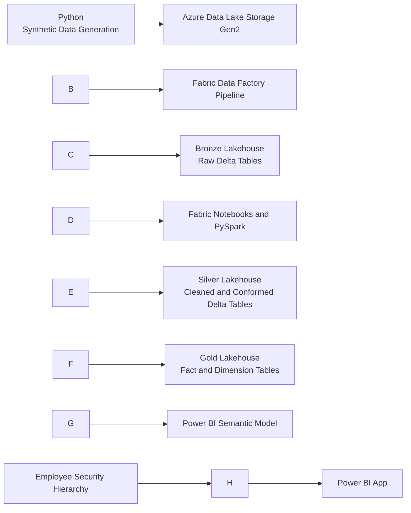

# Commercial Sales Analytics Platform

An end-to-end analytics engineering project built with Microsoft Azure, Microsoft Fabric, PySpark, Delta Lake, and Power BI.

The solution models the commercial operations of a synthetic oral-care business. It moves raw operational data from Azure Data Lake Storage Gen2 through a governed medallion architecture and produces secure, business-ready reporting for commercial managers, regional managers, and sales representatives.

## Project highlights

* Generated and processed about **360,000 invoice-line records** across **120,000 invoices**
* Integrated sales, customer, employee, product, territory, target, and sales-pipeline data
* Orchestrated ingestion from **Azure Data Lake Storage Gen2** with **Fabric Data Factory**
* Transformed raw CSV files into curated **Delta tables** using Fabric notebooks and PySpark
* Implemented **Bronze, Silver, and Gold** data layers
* Built a dimensional model with three fact tables and five conformed dimensions
* Implemented dynamic row-level security based on the commercial reporting hierarchy
* Published a Power BI app for sales performance, targets, regional analysis, customer contribution, product analysis, and pipeline monitoring

## Business problem

Commercial teams often work with fragmented sales, target, customer, product, and pipeline data. This makes it difficult to answer basic management questions consistently:

* Are sales teams meeting their targets?
* Which territories, employees, products, and customers are driving performance?
* Where is performance falling behind?
* How strong is the prospective-order pipeline?
* Can each user access only the data appropriate to their role?

This project creates a single analytical platform that answers those questions through a structured, secure, and reusable data model.

## Architecture

### Data flow

1. Synthetic source data is generated with Python.
2. CSV files are stored in Azure Data Lake Storage Gen2.
3. Fabric Data Factory orchestrates ingestion into the Fabric Lakehouse.
4. Bronze tables preserve the raw source structure.
5. PySpark notebooks clean, standardize, validate, and conform the data in Silver.
6. Gold tables implement the analytical star schema.
7. Power BI consumes the Gold model through a semantic model.
8. Dynamic row-level security filters data according to the employee hierarchy.

## Technology stack

|Layer|Technology|
|-|-|
|Data generation|Python, PySpark|
|Cloud storage|Azure Data Lake Storage Gen2|
|Orchestration|Fabric Data Factory|
|Data platform|Microsoft Fabric Lakehouse, OneLake|
|Transformation|Fabric notebooks, PySpark|
|Storage format|Delta Lake|
|Modelling|Star schema, fact and dimension tables|
|Analytics|Power BI, DAX|
|Security|Dynamic row-level security|
|Version control|GitHub|

## Dataset

The synthetic dataset represents an oral-care commercial organization and contains:

* 360,000 invoice-line sales records
* 120,000 invoices
* Customers
* Employees and management hierarchy
* Products and brands
* Sales territories
* Daily sales targets
* Prospective orders and pipeline data

Because the data is synthetic, the project can demonstrate realistic analytics engineering patterns without exposing confidential business information.

## Medallion architecture

### Bronze

The Bronze layer stores raw ingested data with minimal modification, its purpose is traceability and recovery.

* Preserve source fields
* Record ingestion metadata
* Retain raw values
* Provide a reproducible starting point for downstream processing

### Silver

The Silver layer contains cleaned and conformed business entities.

* Standardize column names and data types
* Handle missing and invalid values
* Remove or flag duplicate records
* Apply business validation rules
* Prepare reusable entities for analytical modelling

### Gold

The Gold layer contains business-ready fact and dimension tables optimized for reporting.

**Fact tables**

* `fact\_sales`
* `fact\_daily\_targets`
* `fact\_prospective\_orders`

**Dimension tables**

* `dim\_employee`
* `dim\_customer`
* `dim\_product`
* `dim\_territory`
* `dim\_date`

## Dynamic row-level security

The security model follows the reporting hierarchy:

|Role|Access|
|-|-|
|Commercial Manager|All data for the commercial area and subordinate teams|
|Regional Manager|Data for assigned regions and subordinate sales representatives|
|Sales Representative|Only the representative's own data|

## 

## Power BI app

The final app covers:

* Sales versus target analysis
* Regional performance
* Employee performance
* Product and brand performance
* Customer contribution analysis
* Sales pipeline monitoring

## Author

**Kingsley Chukwuma**

